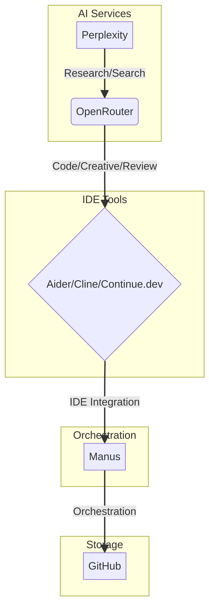

# Free Coding Stack Setup Guide

This document provides complete setup instructions for a free, powerful coding stack that leverages open-source tools and AI.

## A) Aider

Aider is a free, open-source CLI coding agent that lets you code with AI in your terminal.

### Installation

```bash
pip install aider-chat
```

### Configuration

Configure Aider to use OpenRouter by setting the following environment variables:

```bash
export OPENROUTER_API_KEY="your-openrouter-api-key"
export AIDER_MODEL="deepseek/deepseek-coder-6.7b-instruct"
```

You can also specify a different model from OpenRouter, such as Kimi K2 (`moonshot-v1-128k`).

### Usage Examples

Start a new coding session:

```bash
aider
```

Add files to the session:

```bash
/add file1.py file2.js
```

Ask the AI to make changes:

```
> Please refactor the `my_function` in `file1.py` to be more efficient.
```

### Why it Replaces Claude Code

Aider, when paired with a powerful open-source model from OpenRouter, provides a completely free and local alternative to paid services like Claude Code, without sacrificing performance.

## B) Cline

Cline is a free VS Code extension that provides an autonomous coding agent inside your IDE.

### Installation

1.  Open VS Code.
2.  Go to the Extensions view (Ctrl+Shift+X).
3.  Search for "Cline" and click Install.

### Configuration

1.  Open the VS Code settings (Ctrl+,).
2.  Search for "Cline" and enter your OpenRouter API key in the "Cline: Api Key" field.
3.  Set the "Cline: Api Base Url" to `https://openrouter.ai/api/v1`.

### Features

-   **Autonomous Coding:** Give Cline a task and it will work on it autonomously.
-   **File Editing:** Cline can create, edit, and delete files in your workspace.
-   **Terminal:** Cline can run commands in the integrated terminal.
-   **Browser Testing:** Cline can open a browser to test web applications.

### Usage Examples

1.  Open the Cline sidebar.
2.  Enter a prompt, such as "Create a new React component called `Button`."
3.  Click "Start" and watch Cline work.

## C) Continue.dev

Continue.dev is a free, open-source VS Code and JetBrains extension for AI-powered software development.

### Installation

1.  Open VS Code or JetBrains.
2.  Go to the Extensions/Plugins marketplace.
3.  Search for "Continue" and click Install.

### Configuration

1.  Open the Continue sidebar.
2.  Click the settings icon.
3.  Select "OpenRouter" as your AI provider.
4.  Enter your OpenRouter API key.

### Features

-   **Tab Autocomplete:** Get intelligent code completions as you type.
-   **Chat:** Chat with the AI about your code.
-   **Inline Editing:** Highlight code and ask the AI to edit it.

### Usage Examples

-   Start typing a function and let Continue.dev complete it for you.
-   Highlight a block of code, press `Cmd+L` (or `Ctrl+L`), and ask the AI to refactor it.

## D) Complete Stack Diagram

This diagram shows how all the components of the free coding stack connect:


