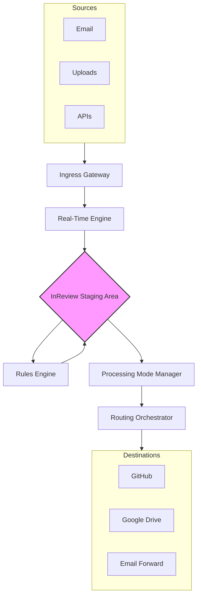

# Universal Data Router (Revvel) - Product Specification

**Author:** Manus AI for Audrey Evans (MIDNGHTSAPPHIRE)
**Version:** 1.0
**Date:** 2026-02-15

## 1. Introduction

This document outlines the complete product specification for the **Universal Data Router (Revvel)**, an advanced data routing platform designed to process information from any source and dispatch it to any destination with a seamless, multi-select interface. This document integrates the initial AI-collaborated design with critical new features requested by the user, serving as the definitive blueprint for development.

### 1.1. Core Purpose

The Universal Data Router is an evolution of the Revvel Email Organizer. Its primary purpose is to provide a centralized, intelligent staging area for all incoming data—from emails and LLM exports to manual uploads and API responses. From this staging area, users can categorize, tag, search, and route data to multiple destinations simultaneously with a single click.

### 1.2. Key Pillars

- **Universal Ingress/Egress:** A plugin-driven architecture to connect to any data source and destination.
- **Intelligent Staging:** An AI-powered "InReview" area for automatic categorization, tagging, and enrichment.
- **Flexible Processing:** Support for real-time, bulk, and date-range based data processing.
- **User-Centric Automation:** A powerful rules engine to automate sorting and routing workflows.
- **Accessibility First:** A commitment to WCAG AAA standards to ensure the application is usable by everyone, with special consideration for deaf and hard-of-hearing users.
- **Sustainable Design:** A built-in carbon savings tracker to quantify the positive environmental impact of efficient data management.

---

## 2. System Architecture

### 2.1. High-Level Components

The system is designed as a modular, scalable, and resilient platform. It consists of several core components that work in concert to handle data ingress, processing, and egress.

| Component                   | Description                                                                                                                                | Technology Stack                      |
| --------------------------- | ------------------------------------------------------------------------------------------------------------------------------------------ | ------------------------------------- |
| **Ingress Gateway**         | A set of plugin-based adapters responsible for receiving data from all sources. It normalizes incoming data into a consistent `DataPacket` format. | FastAPI, Pydantic, OAuthLib           |
| **Real-Time Engine**        | Listens for and processes incoming data in real-time, including email webhooks and attachment extraction.                                    | FastAPI, IMAPClient, python-multipart |
| **InReview Processing Engine** | The core staging area. It uses AI for categorization, extracts content from archives, generates previews, and indexes data for search.      | OpenRouter, Unstructured.io, Tika     |
| **Rules Engine**            | Matches items against user-defined rules for automated sorting, tagging, and routing. Includes a learning component to suggest new rules.    | Custom Logic, JSONB queries           |
| **Processing Mode Manager** | Orchestrates how and when data is processed, supporting `real-time`, `bulk`, and `date-range` modes.                                       | Celery, Redis Streams                 |
| **Routing Orchestrator**    | Manages the dispatch of data to single or multiple destinations using a plugin architecture. It also handles audit logging and error handling. | Celery, Tenacity (for retries)        |
| **Control Plane & UI**      | The user-facing application, including the API for the frontend, WebSocket for real-time updates, and user authentication.                 | FastAPI, SvelteKit, TailwindCSS       |
| **Data Persistence**        | The primary database for storing metadata, user settings, and audit logs, along with a search index for the InReview area.                 | PostgreSQL, SQLAlchemy, Elasticsearch |

### 2.2. Data Flow and Architecture Diagram

The data flows from sources through the Ingress Gateway, is processed by the Real-Time and InReview engines, and is then routed to destinations based on user actions or automated rules.



---

## 3. Database Schema

The database is designed to be robust, scalable, and efficient, using PostgreSQL for relational data and full-text search capabilities. The schema is defined using SQLAlchemy ORM.

### 3.1. Core Tables

| Table               | Description                                                                                             | Key Columns                                       |
| ------------------- | ------------------------------------------------------------------------------------------------------- | ------------------------------------------------- |
| `user`              | Stores user account information and preferences.                                                        | `id`, `email`, `password_hash`, `display_name`    |
| `in_review_item`    | The central staging table for all incoming data items before they are routed.                           | `id`, `source_id`, `category`, `content`, `metadata` |
| `attachment`        | Stores information about attachments extracted from emails or other sources.                            | `id`, `item_id`, `file_name`, `file_path`           |
| `routing_rule`      | User-defined rules for automatically routing items based on conditions.                                 | `id`, `user_id`, `name`, `conditions`, `destination_ids` |
| `auto_sort_rule`    | User-defined rules for automatically categorizing and tagging items upon arrival.                       | `id`, `user_id`, `name`, `conditions`, `actions`    |
| `routing_job`       | Tracks the status of each routing operation.                                                            | `id`, `rule_id`, `item_id`, `status`              |
| `audit_log`         | An immutable log of every action taken within the system for a complete audit trail.                    | `id`, `user_id`, `action`, `entity_type`, `details` |
| `source_config`     | Stores user-configured credentials and settings for each data source (e.g., Gmail, API).                | `id`, `user_id`, `type`, `name`, `credentials`      |
| `destination_config`| Stores user-configured credentials and settings for each destination (e.g., GitHub, Google Drive).      | `id`, `user_id`, `type`, `name`, `credentials`      |
| `tag`               | A simple table for storing user-created tags.                                                           | `id`, `name`                                      |
| `carbon_tracking`   | Records data for the carbon savings tracker.                                                            | `id`, `user_id`, `action`, `savings_grams`        |

### 3.2. SQL-style Schema Definition

Below is a simplified SQL-style representation of the key tables with their relationships.

```sql
-- Main staging table for all items
CREATE TABLE in_review_item (
    id SERIAL PRIMARY KEY,
    user_id INTEGER REFERENCES "user"(id) ON DELETE CASCADE,
    source_id INTEGER REFERENCES source_config(id),
    category VARCHAR(50),
    content TEXT, -- Can be raw text or a path to a file
    metadata JSONB, -- File size, type, original headers, etc.
    search_vector TSVECTOR, -- For full-text search
    created_at TIMESTAMPTZ DEFAULT NOW(),
    processed_at TIMESTAMPTZ
);
CREATE INDEX idx_item_created_at ON in_review_item(created_at DESC);
CREATE INDEX idx_item_search_vector ON in_review_item USING GIN(search_vector);

-- Attachments linked to an item
CREATE TABLE attachment (
    id SERIAL PRIMARY KEY,
    item_id INTEGER REFERENCES in_review_item(id) ON DELETE CASCADE,
    file_name VARCHAR(255) NOT NULL,
    file_path VARCHAR(1024) NOT NULL, -- Path in object storage (e.g., S3)
    category VARCHAR(50),
    metadata JSONB
);

-- User-defined rules for auto-sorting
CREATE TABLE auto_sort_rule (
    id SERIAL PRIMARY KEY,
    user_id INTEGER REFERENCES "user"(id) ON DELETE CASCADE,
    name VARCHAR(255) NOT NULL,
    conditions JSONB NOT NULL, -- e.g., {"from": "*@example.com", "subject_contains": "Invoice"}
    actions JSONB NOT NULL, -- e.g., {"set_category": "document", "add_tags": ["finance", "invoice"]}
    is_active BOOLEAN DEFAULT TRUE
);

-- Audit trail for all system actions
CREATE TABLE audit_log (
    id BIGSERIAL PRIMARY KEY,
    user_id INTEGER REFERENCES "user"(id),
    action VARCHAR(100) NOT NULL, -- e.g., 'ITEM_INGEST', 'ITEM_ROUTE', 'RULE_CREATE'
    details JSONB,
    ip_address INET,
    timestamp TIMESTAMPTZ DEFAULT NOW()
);
```

---

## 4. API Design

The API is designed to be RESTful, secure, and easy to use, following OpenAPI best practices. It will be implemented using FastAPI, providing automatic validation and documentation.

### 4.1. Authentication

- **Method:** All endpoints will be protected using JWT (JSON Web Tokens). Users will authenticate via a `/auth/login` endpoint to receive a token.
- **Token Lifetime:** Tokens will have a short lifespan (e.g., 15 minutes) and be refreshed using a refresh token.
- **Source/Destination Auth:** Credentials for external services (e.g., OAuth tokens for Gmail, API keys for GitHub) will be encrypted and stored securely in the `source_config` and `destination_config` tables.

### 4.2. API Endpoints

Endpoints are organized by resource.

#### Items (InReview Staging Area)
- `GET /items`: List items in the InReview area. Supports pagination and filtering.
  - **Query Params:** `limit`, `offset`, `category`, `source_id`, `start_date`, `end_date`, `tags`
- `GET /items/{item_id}`: Get details of a single item.
- `PATCH /items/{item_id}`: Update an item (e.g., add tags, change category).
- `DELETE /items`: Delete multiple items in bulk.
  - **Body:** `{ "item_ids": ["id1", "id2"] }`

#### Routing and Exporting
- `POST /routing/jobs`: The primary endpoint for multi-destination routing.
  - **Body:** `{ "item_ids": ["id1", "id2"], "destination_ids": ["dest1", "dest2"] }`
- `GET /routing/jobs/{job_id}`: Get the status of a routing job.
- `POST /export`: A flexible endpoint for various export methods.
  - **Body:** `{ "type": "category", "value": "code", "destination_ids": ["dest1"] }`
  - **Export Types:** `individual`, `bulk`, `date_range`, `category`, `source`, `all`

#### Processing Modes & Automation
- `POST /processing/run`: Trigger a processing run.
  - **Body:** `{ "mode": "bulk", "params": { "date_range": ["start", "end"] } }`
- `POST /auto-sort/run`: Trigger the auto-sort process for all items in InReview.
- `GET /rules/auto-sort`: List all auto-sort rules.
- `POST /rules/auto-sort`: Create a new auto-sort rule.
- `PUT /rules/auto-sort/{rule_id}`: Update an auto-sort rule.

#### Webhooks
- `POST /webhooks/email/gmail`: Endpoint for receiving Gmail push notifications.
- `POST /webhooks/generic`: A generic endpoint for other API-based sources.

### 4.3. Real-Time Updates

- **Technology:** WebSockets will be used to provide real-time updates to the frontend.
- **Endpoint:** `/ws/updates`
- **Messages:** The client will receive messages for events like `ITEM_ADDED`, `ITEM_UPDATED`, `ROUTING_STARTED`, `ROUTING_COMPLETE`.

---

## 5. UI/UX and Accessibility

The user interface will be clean, modern, and highly accessible, adhering strictly to WCAG AAA guidelines. The design will feature a glassmorphism aesthetic with a dark theme and warm amber accents, consistent with the existing Revvel design language.

### 5.1. Design System

- **Aesthetic:** Glassmorphism (frosted glass effect) will be used for cards, modals, and sidebars. This will be achieved using CSS `backdrop-filter: blur(10px);` with appropriate background colors and borders to ensure contrast.
- **Color Palette:**
  - **Primary Background:** `#1A1A1A` (Dark Gray)
  - **Primary Text:** `#FFFFFF` (White)
  - **Accent:** `#FFC107` (Warm Amber)
  - **Glass Background:** `rgba(255, 255, 255, 0.1)`
  - **Borders:** `rgba(255, 255, 255, 0.2)`
- **Typography:** A clean, sans-serif font like Inter will be used for its excellent readability.

### 5.2. Accessibility (WCAG AAA)

Accessibility is a core requirement, with special attention given to the needs of deaf and hard-of-hearing users.

- **Visual Notifications:** All system alerts, confirmations, and notifications will be purely visual. No audio cues will be used as the primary means of conveying information.
- **High Contrast:** All text and UI elements will have a contrast ratio of at least 7:1 against their background.
- **Keyboard Navigation:** The entire application will be navigable using only a keyboard. Focus indicators will be clear and prominent.
- **Screen Reader Support:** All elements will have proper ARIA attributes to ensure they are correctly interpreted by screen readers.
- **ADHD-Friendly Design:** The layout will be clean and uncluttered, with a clear visual hierarchy to reduce cognitive load. Animations will be subtle and can be disabled.

### 5.3. Key UI Components (Text-based Wireframes)

#### InReview Dashboard
```
+--------------------------------------------------------------------------+
| [Revvel Logo]  [Search Bar]                                [User Avatar] |
+--------------------------------------------------------------------------+
| Filters |                                                                |
|---------|                                                                |
| [Today] | +------------------------------------------------------------+ |
| [Week]  | | [ ] Email from: sender@example.com   [code]   [tag] 15m ago | |
| [Month] | |     Subject: New feature spec                              | |
| [Custom]| +------------------------------------------------------------+ |
|         | +------------------------------------------------------------+ |
| Source  | | [ ] Uploaded: my_code.zip            [archive]  [tag] 1h ago  | |
| [Gmail] | |                                                            | |
| [Claude]| +------------------------------------------------------------+ |
|         |                                                                |
| Category| [Auto-Sort] [Auto-Download] [Export Selected] [Delete]         |
+--------------------------------------------------------------------------+
```

#### Multi-Destination Routing Modal
```
+------------------------------------------------------+
| Select Destinations for 3 items                      |
+------------------------------------------------------+
| [x] GitHub (Repo: audrey-evans, Folder: /universal)  |
| [ ] Google Drive (Folder: /Revvel/Exports)           |
| [x] Email (To: team@example.com)                     |
| [ ] Local Download                                   |
| [ ] SSRN (Draft)                                     |
+------------------------------------------------------+
|                        [Send] [Cancel]               |
+------------------------------------------------------+
```

---

## 6. Integrations and Plugin Architecture

A key feature of the Universal Data Router is its ability to connect to any source or destination. This is achieved through a robust plugin architecture.

### 6.1. Plugin Design

Each source and destination will be implemented as a self-contained Python class that inherits from a `BasePlugin`. This ensures a consistent interface for authentication, data handling, and error management.

```python
from abc import ABC, abstractmethod

class BasePlugin(ABC):
    def __init__(self, config: dict):
        self.config = config # Contains credentials, settings, etc.

    @abstractmethod
    async def connect(self):
        """Establish a connection to the service."""
        pass

    @abstractmethod
    async def send(self, data_packet: dict) -> dict:
        """Send a data packet to the destination."""
        pass

    @abstractmethod
    async def fetch(self) -> list[dict]:
        """Fetch data from the source."""
        pass
```

### 6.2. Core Integrations

- **Email (Gmail, Outlook, Yahoo):**
  - **Method:** OAuth2 for authentication. For real-time updates, Gmail's Push Notifications API will be used, with IMAP IDLE as a fallback for other providers.
  - **Functionality:** Fetching emails, parsing content and headers, and extracting attachments.

- **Version Control (GitHub, GitLab, Bitbucket):**
  - **Method:** OAuth2 or Personal Access Tokens. The `gh` CLI will be used for GitHub operations where feasible.
  - **Functionality:** Pushing files to specific repositories and folders, creating new commits.

- **Cloud Storage (Google Drive):**
  - **Method:** OAuth2.
  - **Functionality:** Uploading files to specified folders, creating new folders.

- **LLM & AI Agents (OpenRouter, Claude, etc.):**
  - **Method:** API Keys.
  - **Functionality:** Sending content for processing, analysis, or summarization. Receiving and parsing results.

- **SSRN:**
  - **Method:** Likely involves browser automation or a yet-to-be-defined API for submitting academic papers.

---

## 7. Implementation Plan

The project will be developed in phases to ensure a steady rollout of features and to allow for feedback and iteration.

1.  **Phase 1: Core Backend and Database Setup**
    - Implement the database schema using SQLAlchemy and Alembic for migrations.
    - Set up the main FastAPI application with basic authentication.
    - Create the data models for all tables.

2.  **Phase 2: Ingress and InReview Staging**
    - Build the manual upload and email ingress plugins.
    - Implement the InReview dashboard backend API for listing and viewing items.
    - Integrate the OpenRouter AI for basic auto-categorization.

3.  **Phase 3: Routing and Egress**
    - Develop the GitHub and Google Drive destination plugins.
    - Implement the multi-destination routing logic and the `/routing/jobs` endpoint.

4.  **Phase 4: Automation and Real-Time Processing**
    - Build the rules engine for auto-sort and auto-routing.
    - Implement the real-time email listener using webhooks and IMAP IDLE.

5.  **Phase 5: UI Development and Accessibility**
    - Develop the SvelteKit frontend based on the UI/UX wireframes.
    - Ensure all components meet WCAG AAA standards.

6.  **Phase 6: Testing, Deployment, and Documentation**
    - Write comprehensive unit and integration tests.
    - Set up a CI/CD pipeline for deployment.
    - Create the `skills/universal_data_router.md` file.

## 8. References

[1] OpenAI. (2024). *OpenAI API Documentation*. [https://platform.openai.com/docs](https://platform.openai.com/docs)
[2] OpenRouter. (2024). *OpenRouter API Reference*. [https://openrouter.ai/docs/api-reference](https://openrouter.ai/docs/api-reference)
[3] FastAPI. (2024). *FastAPI Documentation*. [https://fastapi.tiangolo.com/](https://fastapi.tiangolo.com/)
[4] SQLAlchemy. (2024). *SQLAlchemy Documentation*. [https://www.sqlalchemy.org/](https://www.sqlalchemy.org/)
[5] W3C. (2023). *Web Content Accessibility Guidelines (WCAG) 2.2*. [https://www.w3.org/TR/WCAG22/](https://www.w3.org/TR/WCAG22/)
